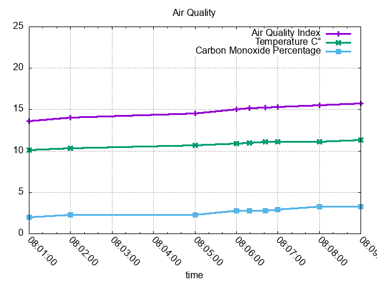
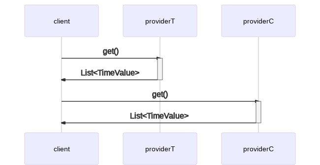
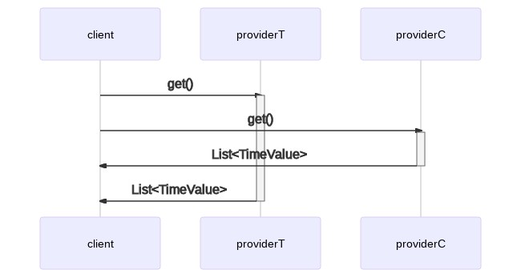

# Esempio di Time Series Data e CompletableFuture in Java

Questo è un esempio per un post sul mio blog che sto scrivendo.


## Come lanciare il programma

```shell
mvn clean compile verify exec:java
```

## Prefazione

Supponiamo di voler calcolare un *indice di qualità dell'aria* basato
su due valori:

- temperatura dell'aria
- percentuale di monossido di carbonio nell'aria

Dati i seguenti simboli:

| simbolo |              significato                       |
|---------|------------------------------------------------|
| `AQi`   | indice di qualità dell'aria                    |
| `T`     | temperatura dell'aria in gradi Celsius         |
| `Tm`    | temperatura massima dell'aria in C°            |
| `C`     | percentuale di monossido di carbonio nell'aria |

Possiamo calcolare l'`AQi` con questa specie di formula:

<!-- AQi = (((T * 100) / Tm) + C) / 2 -->


**DISCLAIMER:** questa formula non è in alcun modo scientifica ed è da
intendersi esclusivamente a scopo educativo. Non voglio che
ambientalisti e veri scienziati mi vengano a cercare a casa con formule
matematiche e accuse di stregoneria. E poi ho visto una scusa per una
fantastica equazione in LaTeX e ne ho approfittato, per motivi estetici
e perché mi fa sembrare intelligente, cosa che certamente non
sono<sup>[[1]](#school)</sup>.

Ciò che la formula prova a esprimere è che al salire di temperatura e
percentuale di monossido di carbonio, la qualità dell'aria decresce.
Sì, tutto ciò è totalmente anti-scientifico ma vedrete che ha senso ai
fini della mia argomentazione.

Assumiamo una temperatura massima di 40C°. Quindi, ad esempio:

```shell
$ bc -l
bc 1.06
Copyright 1991-1994, 1997, 1998, 2000 Free Software Foundation, Inc.
This is free software with ABSOLUTELY NO WARRANTY.
For details type 'warranty'.
t=60; c=100; tm=40; (((t * 100) / tm) + c) / 2
125.00000000000000000000
t=60; c=50; tm=40; (((t * 100) / tm) + c) / 2
100.00000000000000000000
t=40; c=50; tm=40; (((t * 100) / tm) + c) / 2
75.00000000000000000000
t=40; c=10; tm=40; (((t * 100) / tm) + c) / 2
55.00000000000000000000
t=20; c=10; tm=40; (((t * 100) / tm) + c) / 2
30.00000000000000000000
t=10; c=5; tm=40; (((t * 100) / tm) + c) / 2
15.00000000000000000000
t=10; c=0.5; tm=40; (((t * 100) / tm) + c) / 2
12.75000000000000000000
```

Da questo possiamo derivare la seguente tabella totalmente
anti-scientifica:

|        AQi        |                     significato                     |
|-------------------|-----------------------------------------------------|
| da   125  a ∞     | morte orribile                                      |
| da   100  a 125   | morte dolorosa                                      |
| da    75  a 100   | morte                                               |
| da    55  a 75    | è accettabile<sup>[[2]](#it-is-acceptable)</sup>    |
| da    30  a 55    | va bene così<sup>[[3]](#this-is-fine)</sup>         |
| da    15  a 30    | si sta bene                                         |
| da 12.75  a 15    | freschetto                                          |
| da    -∞  a 12.75 | benvenuto a Yakutsk, probabilmente                  |


## Service provider

Supponiamo di avere dei servizi internet che espongano dati di
monitoring riguardo temperatura e livelli di monossido di carbonio.
Questi servizi potrebbero esporre un'api che ci dà una serie di dati di
tipo time series<sup>[[4]](#time-series-data)</sup>.

Quindi, ad esempio, potremmo chiamare un servizio di monitoring della
temperatura, e il servizio ci risponderebbe con una serie di dati time
series come questi:

|        timestamp       | valore  |
|------------------------|---------|
| `2021-01-20T08:00:00Z` | `10.1`  |
| `2021-01-20T08:02:00Z` | `10.3`  |
| `2021-01-20T08:05:00Z` | `10.7`  |
| `2021-01-20T08:06:00Z` | `10.9`  |
| `2021-01-20T08:06:19Z` | `11.0`  |
| `2021-01-20T08:06:42Z` | `11.1`  |
| `2021-01-20T08:09:00Z` | `11.3`  |

Un servizio di monitoring della percentuale di monossido di carbonio
potrebbe invece rispondere con dati simili:

|        timestamp       | valore |
|------------------------|--------|
| `2021-01-20T08:01:00Z` | `2.0`  |
| `2021-01-20T08:02:00Z` | `2.3`  |
| `2021-01-20T08:06:00Z` | `2.8`  |
| `2021-01-20T08:07:00Z` | `2.9`  |
| `2021-01-20T08:08:00Z` | `3.3`  |

Ti prego di notare che ho ordinato i dati per timestamp in modo da
renderli un po' più leggibili, ma non dovresti fare assunzioni sul tipo
di ordinamento dei dati tornati da un provider esterno. Non che ciò sia
di alcuna importanza perché...


# L'algoritmo

...il nostro algoritmo ora richiede di:

1. concatenare i dati di temperatura e percentuale di monossido di
   carbonio
2. ordinare per timestamp

|  id  |        timestamp       | valore  | tipo |
|------|------------------------|---------|------|
| `1`  | `2021-01-20T08:00:00Z` | `10.1`  | `T`  |
| `2`  | `2021-01-20T08:01:00Z` | ` 2.0`  | `C`  |
| `3`  | `2021-01-20T08:02:00Z` | `10.3`  | `T`  |
| `4`  | `2021-01-20T08:02:00Z` | ` 2.3`  | `C`  |
| `5`  | `2021-01-20T08:05:00Z` | `10.7`  | `T`  |
| `6`  | `2021-01-20T08:06:00Z` | `10.9`  | `T`  |
| `7`  | `2021-01-20T08:06:00Z` | ` 2.8`  | `C`  |
| `8`  | `2021-01-20T08:06:19Z` | `11.0`  | `T`  |
| `9`  | `2021-01-20T08:06:42Z` | `11.1`  | `T`  |
| `10` | `2021-01-20T08:07:00Z` | ` 2.9`  | `C`  |
| `11` | `2021-01-20T08:08:00Z` | ` 3.3`  | `C`  |
| `12` | `2021-01-20T08:09:00Z` | `11.3`  | `T`  |
> tipo: T sta per temperatura e C per percentuale di monossido di carbonio

Il nostro compito ora è di scandire i dati, cominciando dall'inizio,
una riga alla volta, computando l'indice di qualità dell'aria man mano
che andiamo avanti, un passo per volta.

La prima cosa da notare qui è che per calcolare la formula del nostro
`AQi`, abbiamo bisogno di avere entrambi i valori per `T` e `C`. In
altre parole, il primo punto in cui possiamo applicare la nostra
formula è quello con id `2`, dal momento che abbiamo un valore per `T`
nell'id `1` e un valore per `C` nell'id `2`. Quindi prendiamo i nostri
valori (`10.1` per `T` e `2.0` per `C`), applichiamo la formula, ed
abbiamo un primo valore per `AQi` di `13.625` che associamo con il
timestamp nell'id `2`, poiché quello è il momento cui si riferisce la
nostra computazione. La nostra prima entry di `AQi` nella serie
risultante deve essere così:

|        timestamp       |  valore  |
|------------------------|----------|
| `2021-01-20T08:01:00Z` | `13.625` |

D'ora in poi, la nostra formula può essere applicata per ogni elemento
rimanente nella serie, tenendo presente che dobbiamo correlare ogni
valore con il valore più recente dell'altro tipo.  In altre parole:

| per l'id | prendi i valori dagli id |
|----------|--------------------------|
|      `2` | `1, 2`                   |
|      `3` | `2, 3`                   |
|      `4` | `3, 4`                   |
|      `5` | `4, 5`                   |
|      `6` | `4, 6`                   |
|      `7` | `6, 7`                   |
|      `8` | `7, 8`                   |
|      `9` | `7, 9`                   |
|     `10` | `9, 10`                  |
|     `11` | `9, 11`                  |
|     `12` | `11, 12`                 |

Puoi pensare a questo tipo di movimento come a una [rolling time
window](https://towardsdatascience.com/time-series-analysis-resampling-shifting-and-rolling-f5664ddef77e)
poiché hai una finestra che si muove nel tempo focalizzandosi sui dati
più recenti per le nostre specifiche misure di `T` e `C` ad ogni
passo<sup>[[5]](#creep)</sup>. 


## Rolling Time Window

Vai avanti, scrolla in basso. Dovresti vederla.

```
/===================================================================================\
|                   Step 01 :: T = 10.1, C = 2.0 :: AQi = 13.625                    |
|----+------+-----+------+-----+------+------+-----+------+------+-----+-----+------|
| id |   1  |  2  |   3  |  4  |   5  |   6  |  7  |   8  |   9  |  10 |  11 |  12  |
|----+------+-----+------+-----+------+------+-----+------+------+-----+-----+------|
|  T | 10.1 |     | 10.3 |     | 10.7 | 10.9 |     | 11.0 | 11.1 |     |     | 11.3 |
|  C |      | 2.0 |      | 2.3 |      |      | 2.8 |      |      | 2.9 | 3.3 |      |
     |<---------->|                                                                


/===================================================================================\
|                   Step 02 :: T = 10.3, C = 2.0 :: AQi = 13.875                    |
|----+------+-----+------+-----+------+------+-----+------+------+-----+-----+------|
| id |   1  |  2  |   3  |  4  |   5  |   6  |  7  |   8  |   9  |  10 |  11 |  12  |
|----+------+-----+------+-----+------+------+-----+------+------+-----+-----+------|
|  T | 10.1 |     | 10.3 |     | 10.7 | 10.9 |     | 11.0 | 11.1 |     |     | 11.3 |
|  C |      | 2.0 |      | 2.3 |      |      | 2.8 |      |      | 2.9 | 3.3 |      |
            |<---------->|

/===================================================================================\
|                   Step 03 :: T = 10.3, C = 2.3 :: AQi = 14.025                    |
|----+------+-----+------+-----+------+------+-----+------+------+-----+-----+------|
| id |   1  |  2  |   3  |  4  |   5  |   6  |  7  |   8  |   9  |  10 |  11 |  12  |
|----+------+-----+------+-----+------+------+-----+------+------+-----+-----+------|
|  T | 10.1 |     | 10.3 |     | 10.7 | 10.9 |     | 11.0 | 11.1 |     |     | 11.3 |
|  C |      | 2.0 |      | 2.3 |      |      | 2.8 |      |      | 2.9 | 3.3 |      |
                  |<---------->|

/===================================================================================\
|                   Step 04 :: T = 10.7, C = 2.3 :: AQi = 14.525                    |
|----+------+-----+------+-----+------+------+-----+------+------+-----+-----+------|
| id |   1  |  2  |   3  |  4  |   5  |   6  |  7  |   8  |   9  |  10 |  11 |  12  |
|----+------+-----+------+-----+------+------+-----+------+------+-----+-----+------|
|  T | 10.1 |     | 10.3 |     | 10.7 | 10.9 |     | 11.0 | 11.1 |     |     | 11.3 |
|  C |      | 2.0 |      | 2.3 |      |      | 2.8 |      |      | 2.9 | 3.3 |      |
                         |<---------->|

/===================================================================================\
|                   Step 05 :: T = 10.9, C = 2.3 :: AQi = 14.775                    |
|----+------+-----+------+-----+------+------+-----+------+------+-----+-----+------|
| id |   1  |  2  |   3  |  4  |   5  |   6  |  7  |   8  |   9  |  10 |  11 |  12  |
|----+------+-----+------+-----+------+------+-----+------+------+-----+-----+------|
|  T | 10.1 |     | 10.3 |     | 10.7 | 10.9 |     | 11.0 | 11.1 |     |     | 11.3 |
|  C |      | 2.0 |      | 2.3 |      |      | 2.8 |      |      | 2.9 | 3.3 |      |
                         |<----------------->|

/===================================================================================\
|                   Step 06 :: T = 10.9, C = 2.8 :: AQi = 15.025                    |
|----+------+-----+------+-----+------+------+-----+------+------+-----+-----+------|
| id |   1  |  2  |   3  |  4  |   5  |   6  |  7  |   8  |   9  |  10 |  11 |  12  |
|----+------+-----+------+-----+------+------+-----+------+------+-----+-----+------|
|  T | 10.1 |     | 10.3 |     | 10.7 | 10.9 |     | 11.0 | 11.1 |     |     | 11.3 |
|  C |      | 2.0 |      | 2.3 |      |      | 2.8 |      |      | 2.9 | 3.3 |      |
                                      |<---------->|

/===================================================================================\
|                   Step 07 :: T = 11.0, C = 2.8 :: AQi = 15.150                    |
|----+------+-----+------+-----+------+------+-----+------+------+-----+-----+------|
| id |   1  |  2  |   3  |  4  |   5  |   6  |  7  |   8  |   9  |  10 |  11 |  12  |
|----+------+-----+------+-----+------+------+-----+------+------+-----+-----+------|
|  T | 10.1 |     | 10.3 |     | 10.7 | 10.9 |     | 11.0 | 11.1 |     |     | 11.3 |
|  C |      | 2.0 |      | 2.3 |      |      | 2.8 |      |      | 2.9 | 3.3 |      |
                                             |<---------->|

/===================================================================================\
|                   Step 08 :: T = 11.1, C = 2.8 :: AQi = 15.275                    |
|----+------+-----+------+-----+------+------+-----+------+------+-----+-----+------|
| id |   1  |  2  |   3  |  4  |   5  |   6  |  7  |   8  |   9  |  10 |  11 |  12  |
|----+------+-----+------+-----+------+------+-----+------+------+-----+-----+------|
|  T | 10.1 |     | 10.3 |     | 10.7 | 10.9 |     | 11.0 | 11.1 |     |     | 11.3 |
|  C |      | 2.0 |      | 2.3 |      |      | 2.8 |      |      | 2.9 | 3.3 |      |
                                             |<----------------->|

/===================================================================================\
|                   Step 09 :: T = 11.1, C = 2.9 :: AQi = 15.325                    |
|----+------+-----+------+-----+------+------+-----+------+------+-----+-----+------|
| id |   1  |  2  |   3  |  4  |   5  |   6  |  7  |   8  |   9  |  10 |  11 |  12  |
|----+------+-----+------+-----+------+------+-----+------+------+-----+-----+------|
|  T | 10.1 |     | 10.3 |     | 10.7 | 10.9 |     | 11.0 | 11.1 |     |     | 11.3 |
|  C |      | 2.0 |      | 2.3 |      |      | 2.8 |      |      | 2.9 | 3.3 |      |
                                                          |<---------->|

/===================================================================================\
|                   Step 10 :: T = 11.1, C = 3.3 :: AQi = 15.525                    |
|----+------+-----+------+-----+------+------+-----+------+------+-----+-----+------|
| id |   1  |  2  |   3  |  4  |   5  |   6  |  7  |   8  |   9  |  10 |  11 |  12  |
|----+------+-----+------+-----+------+------+-----+------+------+-----+-----+------|
|  T | 10.1 |     | 10.3 |     | 10.7 | 10.9 |     | 11.0 | 11.1 |     |     | 11.3 |
|  C |      | 2.0 |      | 2.3 |      |      | 2.8 |      |      | 2.9 | 3.3 |      |
                                                          |<---------------->|

/===================================================================================\
|                   Step 11 :: T = 11.3, C = 3.3 :: AQi = 15.775                    |
|----+------+-----+------+-----+------+------+-----+------+------+-----+-----+------|
| id |   1  |  2  |   3  |  4  |   5  |   6  |  7  |   8  |   9  |  10 |  11 |  12  |
|----+------+-----+------+-----+------+------+-----+------+------+-----+-----+------|
|  T | 10.1 |     | 10.3 |     | 10.7 | 10.9 |     | 11.0 | 11.1 |     |     | 11.3 |
|  C |      | 2.0 |      | 2.3 |      |      | 2.8 |      |      | 2.9 | 3.3 |      |
                                                                       |<---------->|
```

Dato quanto sopra, la nostra time series completa per l'`AQi` è:

|        timestamp       |  valore  |
|------------------------|----------|
| `2021-01-20T08:01:00Z` | `13.625` |
| `2021-01-20T08:02:00Z` | `13.875` |
| `2021-01-20T08:02:00Z` | `14.025` |
| `2021-01-20T08:05:00Z` | `14.525` |
| `2021-01-20T08:06:00Z` | `14.775` |
| `2021-01-20T08:06:00Z` | `15.025` |
| `2021-01-20T08:06:19Z` | `15.150` |
| `2021-01-20T08:06:42Z` | `15.275` |
| `2021-01-20T08:07:00Z` | `15.325` |
| `2021-01-20T08:08:00Z` | `15.525` |
| `2021-01-20T08:09:00Z` | `15.775` |

Se hai guardato attentamente, potresti aver notato che abbiamo un paio
di timestamp duplicati nei risultati, nello specifico
`2021-01-20T08:02:00Z` e `2021-01-20T08:06:00Z`. Questi rappresentano
un paradosso temporale poiché sembra che il nostro `AQi` abbia due
diversi valori allo stesso istante.


Entrambi sappiamo che questi dati finiranno su una pagina web. Non
vorrai certo che uno di quegli sviluppatori hipster del frontend ci
faccia notare una mancanza di logica o, peggio, una inconsistenza nei
nostri dati, vero?

Ne ero certo. Dunque, la mia idea è che possiamo tranquillamente
scartare la prima entry di un timestamp duplicato poiché si riferisce a
un calcolo con dati vecchi. Perché? Be', considera i valori del primo
timestamp duplicato: `2021-01-20T08:02:00Z`. La prima volta che abbiamo
calcolato l'`AQi`, abbiamo preso i dati dagli id `2` e `3` e l'id `2`
si riferisce a un timestamp precedente, nello specifico
`2021-01-20T08:01:00Z`. La seconda volta che abbiamo calcolato l'`AQi`,
abbiamo usato i dati dagli id `3` and `4`, che si riferiscono entrambi
al timestamp `2021-01-20T08:02:00Z`, quindi il risultato di questa
computazione è più rilevante del precedente per il quale abbiamo
prodotto lo stesso timestamp di `2021-01-20T08:02:00Z`.

La stessa cosa si applica all'`AQi` con timestamp
`2021-01-20T08:06:00Z` poiché la prima computazione stava usando gli id
`4` e `6` mentre la seconda stava considerando gli id `6` e `7` che
sono più freschi del timestamp nell'id `4`.

Quindi cancelliamo un paio di righe e il risultato pulito dovrebbe
essere questo:

|        timestamp       |  valore  |
|------------------------|----------|
| `2021-01-20T08:01:00Z` | `13.625` |
| `2021-01-20T08:02:00Z` | `14.025` |
| `2021-01-20T08:05:00Z` | `14.525` |
| `2021-01-20T08:06:00Z` | `15.025` |
| `2021-01-20T08:06:19Z` | `15.150` |
| `2021-01-20T08:06:42Z` | `15.275` |
| `2021-01-20T08:07:00Z` | `15.325` |
| `2021-01-20T08:08:00Z` | `15.525` |
| `2021-01-20T08:09:00Z` | `15.775` |

Proprio come un'equazione è un'ottima scusa per rispolverare un po' di
[LaTeX](https://www.latex-project.org/), una buona serie di dati
temporali è un eccellente candidato per
[gnuplot](http://www.gnuplot.info/).



I dati nel mondo reale sono naturalmente molto più caotici di così e
potresti voler normalizzare il risultato usando un intervallo temporale
arbitrario, ad esempio un minuto:

|        timestamp       |  valore  |
|------------------------|----------|
| `2021-01-20T08:01:00Z` | `13.625` |
| `2021-01-20T08:02:00Z` | `14.025` |
| `2021-01-20T08:03:00Z` | `14.025` |
| `2021-01-20T08:04:00Z` | `14.025` |
| `2021-01-20T08:05:00Z` | `14.525` |
| `2021-01-20T08:06:00Z` | `15.025` |
| `2021-01-20T08:07:00Z` | `15.325` |
| `2021-01-20T08:08:00Z` | `15.525` |
| `2021-01-20T08:09:00Z` | `15.775` |


Ha senso? Spero proprio di sì.


## Scriviamo il codice

Scriviamo un po' di codice. Prima di tutto, definiamo un'interfaccia
per il nostro calcolatore di `AQi`, così che poi possiamo fornirne
diverse implementazioni.

Il codice di questa interfaccia può essere visto
[qui](https://github.com/mcaserta/time-series-concurrency-example/blob/master/src/main/java/com/mirkocaserta/example/AirQualityIndexCalculator.java).

L'interfaccia è un posto conveniente dove implementare la formula
dell'`AQi`:

```java
static double airQualityIndex(double temperature, double carbonMonoxidePercentage, double maxTemperature) {
    return (((temperature * 100) / maxTemperature) + carbonMonoxidePercentage) / 2;
}
```

Questo metodo prende una temperatura, una percentuale di monossido di
carbonio, una temperatura massima e torna l'`AQi`. Bene.

La parte interessante però è in questo metodo:

```java
List<TimeValue> calculate(List<TimeValue> temperatures, List<TimeValue> carbonMonoxidePercentages);
```

Questo ci dice che il metodo `calculate` prende due liste di
`TimeValue`: la prima è una lista di temperature e l'altra è una lista
di percentuali di monossido di carbonio. Quindi ritorna una lista di
`TimeValue`, solo che questa volta la lista rappresenta gli indici di
qualità dell'aria.

Cos'è un `TimeValue`? Possiamo vedere la sua definizione
[qui](https://github.com/mcaserta/time-series-concurrency-example/blob/c5b4574a40be0a818aba1513aaef7cc9d2a41d2b/src/main/java/com/mirkocaserta/example/TimeValue.java#L7).
Nonostante tutto ciò sembri orribilmente complicato per via della
verbosità del linguaggio Java e alcuni dettagli di implementazione,
puoi pensare a un `TimeValue` come un modo comodo di rappresentare un
`Instant` nel tempo ed il suo valore associato. Niente di ché, davvero.


## Scrivere codice come fosse il 1984

Ora che abbiamo un semplice framework per i nostri calcoli, scriviamo
una prima implementazione usando uno stile *vecchia scuola*. Il codice
completo è
[qui](https://github.com/mcaserta/time-series-concurrency-example/blob/master/src/main/java/com/mirkocaserta/example/OldSchoolAirQualityIndexCalculator.java).
Diamogli un'occhiata.

Il nostro calcolatore prende la temperatura massima nel costruttore e
ne immagazina il valore nella costante d'istanza `maxTemperature`
poiché ci servirà dopo quando invocheremo la funzione per l'`AQi`.

Il nostro metodo `calculate` deve iniziare con questi due step:

1. concatenare i dati di temperatura e percentuale di monossido di
   carbonio in una singola struttura dati
2. ordinare il risultato per timestamp

Il primo passo è implementato in questo blocco di codice:

```java
// key = time value type (C = carbonMonoxidePercentage, T = temperature)
// concatenated with the timestamp as a string
Map<String, TimeValue> timeValuesByType = new HashMap<>();

for (TimeValue temperature : temperatures) {
    timeValuesByType.put("T".concat(temperature.ts()), temperature);
}

for (TimeValue carbonMonoxidePercentage : carbonMonoxidePercentages) {
    timeValuesByType.put("C".concat(carbonMonoxidePercentage.ts()), carbonMonoxidePercentage);
}
```

La chiave nella nostra variabile `timeValuesByType` è una
concatenazione in stringa della lettera `T` per temperatura o `C` per
percentuale di monossido di carbonio, seguita dal timestamp. Dobbiamo
fare ciò per poter poi distinguere tra i due tipi di dato più avanti.
Le stringhe nella chiave avranno questo aspetto:
`T2021-02-03T08:00:00.000Z`.

L'ordinamento è realizzato in questo blocco:

```java
Map<String, TimeValue> timeValuesByTypeSortedByTimestamp = new LinkedHashMap<>();
List<String> keysSortedByTimestamp = new ArrayList<>(timeValuesByType.keySet());
keysSortedByTimestamp.sort(comparing(s -> timeValuesByType.get(s).timestamp()));

for (String key : keysSortedByTimestamp) {
    timeValuesByTypeSortedByTimestamp.put(key, timeValuesByType.get(key));
}
```

Questo è solo il modo supercomplicato di Java per ordinare la nostra
mappa in base al timestamp che abbiamo nei valori della mappa stessa.
Dichiariamo una mappa `timeValuesByTypeSortedByTimestamp`, implementata
da una `LinkedHashMap` poiché vogliamo preservare l'ordine di
iterazione delle entry della mappa.  Poi inglobiamo tutte le chiavi
della nostra mappa originaria `timeValuesByType` in un ArrayList dato
che abbiamo bisogno di una `List` per poterci invocare `sort`.  La
funzione di comparazione che passiamo a `sort` pesca il timestamp
dell'entry relativa nella mappa originale che abbiamo chiamato
`timeValuesByType`.  Quindi iteriamo `keysSortedByTimestamp`,
aggiungendo entry alla nostra mappa
`timeValuesByTypeSortedByTimestamp`.

Ora dichiariamo una mappa per i risultati dei nostri calcoli dell'`AQi`
e un paio di variabili che ci serviranno dopo:

```java
Map<Instant, Double> airQualityIndexMap = new HashMap<>();
TimeValue lastTemperature = null;
TimeValue lastCarbonMonoxidePercentage = null;
```

Qui inizia la parte divertente. Cicliamo attraverso le entry della
mappa nella nostra variabile `timeValuesByTypeSortedByTimestamp`
precedentemente definita.

```java
for (Map.Entry<String, TimeValue> entry : timeValuesByTypeSortedByTimestamp.entrySet()) {
    ...
```

Sappiamo che se la chiave inizia con una `T`, abbiamo un valore di
temperatura e, in tal caso lo immagazziniamo nella variabile
`lastTemperature`. Altrimenti, il valore deve essere di tipo `C` per
carbonio, e quindi facciamo la stessa cosa per la variabile
`lastCarbonMonoxidePercentage`.

```java
if (entry.getKey().startsWith("T")) {
    lastTemperature = entry.getValue();
} else if (entry.getKey().startsWith("C")) {
    lastCarbonMonoxidePercentage = entry.getValue();
}
```

A questo punto, se abbiamo un valore sia per `T` che per `C`, possiamo
procedere a calcolare il nostro `AQi` e memorizzare il suo valore nella
variabile `airQualityIndexMap`.

```java
if (lastTemperature != null && lastCarbonMonoxidePercentage != null) {
    airQualityIndexMap.put(
        mostRecent(lastTemperature.timestamp(), lastCarbonMonoxidePercentage.timestamp()),
        airQualityIndex(lastTemperature.value(), lastCarbonMonoxidePercentage.value(), maxTemperature)
    );
}
```

Stiamo prendendo il timestamp più recente tra i due `TimeValue` usando
una funzioncina di aiuto che abbiamo definito precedentemente
nell'interfaccia del calcolatore.

Un effetto collaterale desiderato dell'usare una mappa per questa
struttura dati è che, quando inseriamo un nuovo valore per un timestamp
esistente, la entry viene sovrascritta dal più recente. Questo risolve
il nostro problema dei timestamp duplicati.

Alla fine del ciclo, i nostri risultati sono quasi pronti. Dobbiamo
solo ordinarli di nuovo per timestamp e ritornare i valori come una
`List` di `TimeValue`.

```java
List<Instant> keys = new ArrayList<>(airQualityIndexMap.keySet());
keys.sort(Instant::compareTo);
List<TimeValue> results = new ArrayList<>();

for (Instant key : keys) {
    results.add(TimeValue.of(key, airQualityIndexMap.get(key)));
}
```


## Eleganza funzionale

Possiamo fare meglio di così? Certo. Usiamo un'arma elegante per tempi
più civilizzati: la programmazione funzionale. Il nostro
[FunctionalAirQualityIndexCalculator](https://github.com/mcaserta/time-series-concurrency-example/blob/master/src/main/java/com/mirkocaserta/example/FunctionalAirQualityIndexCalculator.java)
è ridotto quasi all'osso, ma solo perché la logica principale dietro i
calcoli ora si trova
nell'[AirQualityIndexCollector](https://github.com/mcaserta/time-series-concurrency-example/blob/master/src/main/java/com/mirkocaserta/example/AirQualityIndexCollector.java).

Il nostro calcolatore è molto più semplice ora. La prima parte è un po'
convoluta quindi guardiamola per prima:

```java
List<TypedTimeValue> timeSeries = Stream.concat(
   temperatures.stream().map(e -> new TypedTimeValue(TypedTimeValue.Type.T, e)),
   carbonMonoxidePercentages.stream().map(e -> new TypedTimeValue(TypedTimeValue.Type.C, e))
).collect(Collectors.toUnmodifiableList());
```

Ci sono diversi pattern funzionali al lavoro qui:

- i dati di temperatura e percentuale di monossido di carbonio sono
  trasmessi e mappati in un contenitore in modo da poter poi capire se
  il dato che stiamo guardando è di tipo `T` o `C`

- i due stream risultanti sono concatenati usando `Stream.concat`

- alla fine collezioniamo lo stream concatenato in una
  `List<TypedTimeValue>` non modificabile

```java
return timeSeries.stream().parallel()
    .collect(AirQualityIndexCollector.toUnmodifiableList(maxTemperature));
```

La variabile `timeSeries` è quindi trasmessa in parallelo in un
collettore che fa il lavoro sporco e ritorna una `List<TimeValue>` non
modificabile con gli indici di qualità dell'aria.

Diamo un'occhiata al collettore.

```java
public class AirQualityIndexCollector
        implements Collector<TypedTimeValue, Queue<TypedTimeValue>, List<TimeValue>> {
    ...
```

Stiamo implementando l'interfaccia `Collector`. I parametri di tipo che
stiamo fornendo esprimono tre cose:

- stiamo collezionando valori di tipo `TypedTimeValue`
- il nostro accumulatore interno usa una `Queue<TypedTimeValue>`
- alla fine del lavoro, ritorniamo una  `List<TimeValue>`

Una `Queue` è solo una `List` thread safe. Ne forniamo
l'implementazione usando il metodo `supplier`:

```java
@Override
public Supplier<Queue<TypedTimeValue>> supplier() {
    return ConcurrentLinkedQueue::new;
}
```

In questo caso, l'implementazione è una `ConcurrentLinkedQueue` che, di
nuovo, è solo una specie di `ArrayList` thread safe.

```java
@Override
public BiConsumer<Queue<TypedTimeValue>, TypedTimeValue> accumulator() {
    return Queue::add;
}
```

L'accumulatore deve tornare una funzione che il collettore usa per
accumulare i dati in input. Come puoi vedere, torniamo semplicemente un
riferimento al metodo `add` di `Queue`.

```java
@Override
public BinaryOperator<Queue<TypedTimeValue>> combiner() {
    return (typedTimeValues, typedTimeValues2) -> {
        typedTimeValues.addAll(typedTimeValues2);
        return typedTimeValues;
    };
}
```

Il metodo `combiner` deve tornare una funzione che combina due
accumulatori.  L'implementazione deve prendere tutti gli elementi del
secondo accumulatore ed aggiungerli al primo, che non suona molto
funzionale in termini di immutabilità ma in questo caso è un
comportamento atteso, ed è totalmente ok.

```java
@Override
public Function<Queue<TypedTimeValue>, List<TimeValue>> finisher() {
    ...
```

Infine, il `finisher` deve tornare una funzione che prende tutti i
valori accumulati nella nostra `Queue<TypedTimeValue>` e torna una
`List<TimeValue>` con i nostri indici di qualità dell'aria.

```java
final Map<Instant, TimeValue> aqiAccumulator = new HashMap<>();
```

Questa è una mappa che serve a collezionare gli indici di qualità
dell'aria.  Come puoi vedere è indicizzata per timestamp, così che non
avremo entry duplicate quando calcoli più recenti per uno stesso
timestamp saranno messe nella mappa rimpiazzando quelle vecchie.

```java
return accumulator -> {
   accumulator.stream()
           .map(TypedTimeValue::timestamp)
           .sorted()
           .forEach(entryTS -> {
               final TimeValue lastTemperature = getClosest(accumulator, TypedTimeValue.Type.T, entryTS);
               final TimeValue lastCarbonMonoxidePercentage = getClosest(accumulator, TypedTimeValue.Type.C, entryTS);

               if (lastTemperature != null && lastCarbonMonoxidePercentage != null) {
                   Instant timestamp = mostRecent(lastTemperature.timestamp(), lastCarbonMonoxidePercentage.timestamp());
                   aqiAccumulator.put(timestamp, TimeValue.of(timestamp, airQualityIndex(lastTemperature.value(), lastCarbonMonoxidePercentage.value(), maxTemperature)));
               }
           });

   return aqiAccumulator.values().stream()
           .sorted()
           .collect(Collectors.toUnmodifiableList());
};
```

Questo è un bel mappazzone di codice ma guardiamolo un po' alla volta.
Stiamo trasmettendo i dati accumulati, estraendo il timestamp,
ordinando per questo e, per ogni timestamp, guardiamo ai dati di
temperatura e percentuale di monossido di carbonio con il timestamp più
vicino. *Più vicino* vuol dire che il timestamp che stiamo valutando
deve essere precedente o uguale al timestamp in questione.

Se abbiamo entrambi i dati (`T` e `C`), possiamo procedere al calcolo
dell'`AQi` e mettere il suo valore nella mappa `aqiAccumulator`.

Infine, tutto quello che dobbiamo fare è prendere i valori nella mappa
`aqiAccumulator`, ordinarli per timestamp e collezionarli in una
`List<TimeValue>` non modificabile.

L'ordinamento è reso possibile dal fatto che la nostra classe
`TimeValue` implementa `Comparable<TimeValue>`.

Ci sono diversi punti nel metodo `finisher` in cui guardo dentro le
strutture dati su cui sto iterando, il ché, di nuovo, non sembra molto
kosher in termini di programmazione funzionale, ma è ok perché so che i
dati che sto esaminando non sono suscettibili a modifiche dietro le
quinte da parte di thread concorrenti.

Questo calcolatore è migliore di quello *vecchia scuola*? Non ne sono
sicuro.  Questa roba è ancora abbastanza verbosa, ma mi sembra più
facile da leggere dal momento che molto del codice è scritto in uno
stile dichiarativo invece che imperativo.


## Considerazioni sulla concorrenza

Siccome dobbiamo recuperare due diversi set di dati da due diversi
provider (uno per i dati di temperatura e un altro per i dati di
percentuale di monossido di carbonio), potremmo voler far girare i
client in parallelo. Questo ha un vantaggio rispetto all'esecuzione a
singolo thread in cui dovresti serializzare le chiamate ai provider.

In un ambiente a singolo threaded, potresti scrivere:

```java
TimeValueProvider providerT = new TemperatureTimeValueProvider();
TimeValueProvider providerC = new CarbonMonoxidePercentageProvider();
List<TimeValue> timeValuesT = providerT.get();
List<TimeValue> timeValuesC = providerC.get();
```

Questo si traduce nel seguente modello di esecuzione seriale:



Come abbiamo detto, possiamo fare meglio di così. In un ambiente
multithread, possiamo lanciare due client concorrenti e far partire il
processamento dei dati appena abbiamo ricevuto risposta da entrambi.
Questo ci risparmia un po' di tempo e potenzialmente velocizza i nostri
tempi di risposta.



Come implementiamo questo modello di esecuzione nel nostro codice? Ci
sono diverse opzioni, ma la più popolare, e quella che personalmente
preferisco, è usare i `CompletableFuture`, che sono stati introdotti in
Java 8, se non ricordo male.

Un `CompletableFuture` è un contenitoree per una computazione. Gli dai
il codice che vuoi eseguire e il runtime di Java si preoccupa di farlo
girare in concorrenza in uno scheduler multithread. Lo scheduler è
ovviamente configurabile ma i default vanno bene per il nostro caso.
Puoi vedere l'esempio completo
[qui](https://github.com/mcaserta/time-series-concurrency-example/blob/master/src/main/java/com/mirkocaserta/example/App.java).

Nel mio esempio ho dichiarato il mio `CompletableFuture` così:

```java
CompletableFuture<List<TimeValue>> timedValuesFuture1 = CompletableFuture.supplyAsync(() -> {
   log("Calling provider1...");
   List<TimeValue> timeValues = provider1.get();
   log(String.format("provider 1 returned: %s\n", timeValues));
   return timeValues;
});
```

Questo è un po' verboso poiché volevo includere dei log per mostrare
come il codice gira in parallelo. Potrei benissimo aver scritto invece:

```java
CompletableFuture<List<TimeValue>> timedValuesFuture1 = CompletableFuture.supplyAsync(provider1::get);
```

Questo è sempre verboso ma decisamente meglio di prima. Poiché la
computazione nel nostro `CompletableFuture` ritorna una
`List<TimeValue>`, il metodo `supplyAsync` ritorna un
`CompletableFuture<List<TimeValue>>`, che è il modo di Java di dire che
la variabile `timedValuesFuture1` è un `CompletableFuture` che contiene
una `List<TimeValue>`. Ti prego di notare che il codice che stiamo
passando al metodo `supplyAsync` è dentro una lambda. Questo significa
che il nostro codice non viene eseguito nel metodo `supplyAsync` ma il
runtime di Java è libero di scegliere il momento migliore per
eseguirlo.  Lo scheduler di default generalmente farà partire i
`CompletableFuture` appena definiti ma devi sapere che non è
necessariamente così e che definire una lambda non vuol dire che questa
sia eseguita nel punto in cui è dichiarata.

Ora abbiamo bisogno di un modo per essere sicuro che i nostri
`CompletableFuture` abbiano finito la loro esecuzione prima di poter
procedere. Questo lo si fa componendo i future e chiamando il metodo
`join` sul future risultante:

```java
CompletableFuture.allOf(timedValuesFuture1, timedValuesFuture2).join();
```

Il metodo `allOf` ritorna un nuovo `CompletableFuture` che inscatola i
future che gli stiamo passando.  Su questo nuovo future poi chiamiamo
`join` che blocca l'esecuzione fin quando tutti i future interni hanno
finito il lavoro.

Dopo questa linea siamo sicuri che i nostri thread sono stati eseguiti,
quindi possiamo prendere i dati di cui abbiamo bisogno dai nostri
future originali usando il metodo `join`:

```java
List<TimeValue> timeValues1 = timedValuesFuture1.join();
List<TimeValue> timeValues2 = timedValuesFuture2.join();
```


## Esempio di output

Quando lanci l'applicazione, dovresti vedere un output simile a questo:

```
2021-02-03T17:50:26.772545406 --- [main] Hello concurrent world!
2021-02-03T17:50:26.801737530 --- [ForkJoinPool.commonPool-worker-3] Calling provider1...
2021-02-03T17:50:26.802105151 --- [main] Calling allOf(...).join()
2021-02-03T17:50:26.802202415 --- [ForkJoinPool.commonPool-worker-5] Calling provider2...
2021-02-03T17:50:27.834127796 --- [ForkJoinPool.commonPool-worker-5] provider 2 returned: [TimeValue{timestamp=2021-01-18T08:00:22Z, value=76.629}, TimeValue{timestamp=2021-01-18T08:00:45Z, value=90.241}]
2021-02-03T17:50:27.834702562 --- [ForkJoinPool.commonPool-worker-3] provider 1 returned: [TimeValue{timestamp=2021-01-18T08:00:24Z, value=30.318}, TimeValue{timestamp=2021-01-18T08:00:35Z, value=13.521}, TimeValue{timestamp=2021-01-18T08:00:35Z, value=29.518}, TimeValue{timestamp=2021-01-18T08:00:36Z, value=0.818}, TimeValue{timestamp=2021-01-18T08:00:46Z, value=8.695}, TimeValue{timestamp=2021-01-18T08:00:50Z, value=31.233}, TimeValue{timestamp=2021-01-18T08:00:51Z, value=24.675}, TimeValue{timestamp=2021-01-18T08:00:53Z, value=38.477}]
2021-02-03T17:50:27.835040844 --- [main] After allOf(...).join()
2021-02-03T17:50:27.852793190 --- [main] timeValues = [TimeValue{timestamp=2021-01-18T08:00:24Z, value=76.212}, TimeValue{timestamp=2021-01-18T08:00:35Z, value=75.212}, TimeValue{timestamp=2021-01-18T08:00:36Z, value=39.337}, TimeValue{timestamp=2021-01-18T08:00:45Z, value=46.143}, TimeValue{timestamp=2021-01-18T08:00:46Z, value=55.989}, TimeValue{timestamp=2021-01-18T08:00:50Z, value=84.161}, TimeValue{timestamp=2021-01-18T08:00:51Z, value=75.964}, TimeValue{timestamp=2021-01-18T08:00:53Z, value=93.217}]
```

Puoi vedere che ci sono tre diversi thread al lavoro qui:

1. main
2. ForkJoinPool.commonPool-worker-3
3. ForkJoinPool.commonPool-worker-5

È interessante notare qui che, in questo specifico run,
`allOf(...).join()` è stato chiamato molto prima che fosse chiamato il
provider 2 e che entrambi i risultati fossero tornati dai provider.

Il tuo output sarà certamente diverso poiché:

1. l'ordine di esecuzione dei thread è non deterministico
2. i valori dei provider sono generati casualmente


## Conclusione

Ce l'hai fatta! È stata una bella camminata. Spero sia stata
divertente.  Ho speso un bel po' di tempo su questa cosa quando stavo
cercando di entrare più a fondo in alcuni aspetti che ho incontrato a
lavoro. Ti suggerisco di fare lo stesso quando ti capitano problemi che
hanno bisogno di approfondimenti. Spero tu abbia trovato tutto ciò
utile. 

Ciao, [Mirko](https://mirkocaserta.com).


## Note a pié di pagina

<a name="school">[1]:</a> questa è la mia vendetta per tutti i brutti
voti a scuola.

<a name="this-is-fine">[2]:</a> 

<a name="it-is-acceptable">[3]:</a> 

<a name="time-series-data">[4]:</a> I time series data, anche
conosciuti come time-stamped data, sono una sequenza di dati
indicizzati in ordine di tempo.  Time-stamped sono dati collezionati
in diversi momenti. Questi dati consistono tipicamente in misure
successive fatta dalla stessa fonte in un intervallo di tempo e sono
usati per tracciarne il cambiamento nel tempo.

<a name="creep">[5]:</a> Mi piace pensare a questo movimento come a una
specie di danza, e la trovo sexy. Penso che [I'm a creep, I'm a
weirdo](https://youtu.be/XFkzRNyygfk).


## Bonus


[Credits](https://www.reddit.com/r/ProgrammerHumor/comments/l1h14v/the_industry_is_really_shifting/)
