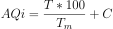

# Java concurrency with ComposableFuture example

This is an example for a blog post I'm writing.

To run the program:

```shell
mvn clean compile exec:java
```

## Preface

Suppose we want to calculate an *air quality index* based on two values:

- air temperature
- percentage of carbon monoxide in the air

Given the following symbols:

| symbol |                meaning                   |
|--------|------------------------------------------|
| `AQi`  | air quality index                        |
| `T`    | air temperature in Celsius degrees       |
| `Tm`   | maximum air temperature in C°            |
| `C`    | percentage of carbon monoxide in the air |

We may calculate the `AQi` with the following sorry excuse of a formula:

<!-- AQi = ((T * 100) / Tm) + C -->


**DISCLAIMER:** please note that this formula is in no way scientific and it's only intended for education purposes. I
don't want environmentalists and real scientists chasing me around with math formulas and accusations of quackery. I saw
an excuse for a pretty LaTex equation and I took it, because aesthetics.

What the formula attempts to say is that as the temperature and the carbon monoxide percentage increase, the air quality index decreases.

I assume a maximum temperature of 40C°. So, for instance:

|     AQi      |    meaning     |
|--------------|----------------|
|  200 to ∞    | horrible death |
|  100 to 200  | painful death  |
| 12.5 to 100  | death          |
|    0 to 12.5 | this is fine   |
|   -∞ to 0    | pretty cool    |

## Service providers setup

`TODO:`

## Concurrency considerations

`TODO:`

## Example output

`TODO:`

`TODO:` link the blog post here when I'm done.
