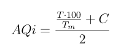

# Java concurrency with ComposableFuture example

This is an example for a blog post I'm writing.

To run the program:

```shell
mvn clean compile exec:java
```

## Preface

Suppose we want to calculate an *air quality index* based on two values:

- air temperature
- percentage of carbon monoxide in the air

Given the following symbols:

| symbol |                meaning                   |
|--------|------------------------------------------|
| `AQi`  | air quality index                        |
| `T`    | air temperature in Celsius degrees       |
| `Tm`   | maximum air temperature in C°            |
| `C`    | percentage of carbon monoxide in the air |

We may calculate the `AQi` with the following sorry excuse of a formula:

<!-- AQi = (((T * 100) / Tm) + C) / 2 -->


**DISCLAIMER:** please note that this formula is in no way scientific and it's
only intended for educational purposes. I don't want environmentalists and real
scientists chasing me around with math formulas and accusations of quackery. I
saw an excuse for a pretty LaTex equation and I took it, because aesthetics.

What the formula attempts to say is that as the temperature and the carbon
monoxide percentage increase, the air quality index decreases.

I assume a maximum temperature of 40C°. So, for instance:

|     AQi      |    meaning     |
|--------------|----------------|
|  200 to ∞    | horrible death |
|  100 to 200  | painful death  |
| 12.5 to 100  | death          |
|    0 to 12.5 | this is fine   |
|   -∞ to 0    | pretty cool    |


## Service providers

Suppose we have internet services that expose
temperature and carbon monoxide levels monitoring. Those services would expose
an api that gives us time series data<sup>[[1]](#time-series-data)</sup>.

So, for instance, we might call a temperature monitoring service and it would
respond with time series data like this:

|       timestamp      | value |
|----------------------|-------|
| 2021-01-20T08:00:00Z |  10.1 |
| 2021-01-20T08:02:00Z |  10.3 |
| 2021-01-20T08:05:00Z |  10.7 |
| 2021-01-20T08:06:00Z |  10.9 |
| 2021-01-20T08:06:19Z |  10.9 |
| 2021-01-20T08:06:42Z |  10.9 |
| 2021-01-20T08:09:00Z |  11.1 |

A carbon monoxide percentage monitoring service might instead respond with data
that looks like this:

|       timestamp      | value |
|----------------------|-------|
| 2021-01-20T08:01:00Z |   2.0 |
| 2021-01-20T08:02:00Z |   2.3 |
| 2021-01-20T08:06:00Z |   2.8 |
| 2021-01-20T08:07:00Z |   2.9 |
| 2021-01-20T08:08:00Z |   3.3 |


## Concurrency considerations

`TODO:`

## Example output

`TODO:`

`TODO:` link the blog post here when I'm done.

## Footnotes

<a name="time-series-data">[1]</a> Time series data, also referred to as
time-stamped data, is a sequence of data points indexed in time order.
Time-stamped is data collected at different points in time. These data points
typically consist of successive measurements made from the same source over a
time interval and are used to track change over time.
