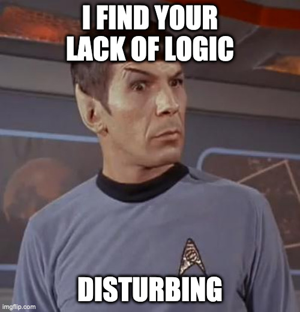

# Java concurrency with time series data and ComposableFuture example

This is an example for a blog post I'm writing.


## How to run the program

```shell
mvn clean compile verify exec:java
```

## Preface

Suppose we want to calculate an *air quality index* based on two values:

- air temperature
- percentage of carbon monoxide in the air

Given the following symbols:

| symbol |                meaning                   |
|--------|------------------------------------------|
| `AQi`  | air quality index                        |
| `T`    | air temperature in Celsius degrees       |
| `Tm`   | maximum air temperature in C°            |
| `C`    | percentage of carbon monoxide in the air |

We may calculate the `AQi` with the following sorry excuse of a formula:

<!-- AQi = (((T * 100) / Tm) + C) / 2 -->


**DISCLAIMER:** please note that this formula is in no way scientific, and it's
intended for educational purposes only. I don't want environmentalists and real
scientists chasing me around with math formulas and accusations of quackery. 
Also, I saw a chance for a pretty LaTeX equation and I took it, because 
aesthetics... and it makes me look smart, which I certainly am 
not<sup>[[1]](#school)</sup>.

What the formula attempts to say is that as the temperature and the carbon
monoxide percentage rise, the air quality decreases. Yeah, this is totally
unscientific but bear with me for the sake of argumentation, please.

I assume a maximum temperature of 40C°. So, for instance:

```shell
bc -l
bc 1.06
Copyright 1991-1994, 1997, 1998, 2000 Free Software Foundation, Inc.
This is free software with ABSOLUTELY NO WARRANTY.
For details type 'warranty'.
t=60; c=100; tm=40; (((t * 100) / tm) + c) / 2
125.00000000000000000000
t=60; c=50; tm=40; (((t * 100) / tm) + c) / 2
100.00000000000000000000
t=40; c=50; tm=40; (((t * 100) / tm) + c) / 2
75.00000000000000000000
t=40; c=10; tm=40; (((t * 100) / tm) + c) / 2
55.00000000000000000000
t=20; c=10; tm=40; (((t * 100) / tm) + c) / 2
30.00000000000000000000
t=10; c=5; tm=40; (((t * 100) / tm) + c) / 2
15.00000000000000000000
t=10; c=0.5; tm=40; (((t * 100) / tm) + c) / 2
12.75000000000000000000
```

From this we can derive the following totally unscientific table:

|     AQi        |                       meaning                       |
|----------------|-----------------------------------------------------|
|   125 to ∞     | horrible death                                      |
|   100 to 125   | painful death                                       |
|    75 to 100   | death                                               |
|    55 to 75    | it is acceptable<sup>[[2]](#it-is-acceptable)</sup> |
|    30 to 55    | this is fine<sup>[[3]](#this-is-fine)</sup>         |
|    15 to 30    | fine and dandy                                      |
| 12.75 to 15    | pretty cool                                         |
|    -∞ to 12.75 | welcome to Yakutsk, probably                        |


## Service providers

Suppose we have internet services that expose temperature and carbon monoxide
level monitoring values.  These services might expose an api that gives us
time series data<sup>[[4]](#time-series-data)</sup>.

So, for instance, we might call a temperature monitoring service, and it would
respond with time series data like this:

|        timestamp       | value  |
|------------------------|--------|
| `2021-01-20T08:00:00Z` | `10.1` |
| `2021-01-20T08:02:00Z` | `10.3` |
| `2021-01-20T08:05:00Z` | `10.7` |
| `2021-01-20T08:06:00Z` | `10.9` |
| `2021-01-20T08:06:19Z` | `11.0` |
| `2021-01-20T08:06:42Z` | `11.1` |
| `2021-01-20T08:09:00Z` | `11.3` |

A carbon monoxide percentage monitoring service might instead respond with data
that looks like this:

|        timestamp       | value |
|------------------------|-------|
| `2021-01-20T08:01:00Z` | `2.0` |
| `2021-01-20T08:02:00Z` | `2.3` |
| `2021-01-20T08:06:00Z` | `2.8` |
| `2021-01-20T08:07:00Z` | `2.9` |
| `2021-01-20T08:08:00Z` | `3.3` |

Please note that I have sorted the data by timestamp to make it a bit more
readable, but you shouldn't make assumptions on the sort order of the data
returned by an external provider. Not that it is of any importance here as
our algorithm now requires concatenating the temperature and carbon monoxide
percentage data and then sort the result by timestamp like this:

|  id  |        timestamp       | value  | type |
|------|------------------------|--------|------|
| `1`  | `2021-01-20T08:00:00Z` | `10.1` | `T`  |
| `2`  | `2021-01-20T08:01:00Z` | ` 2.0` | `C`  |
| `3`  | `2021-01-20T08:02:00Z` | `10.3` | `T`  |
| `4`  | `2021-01-20T08:02:00Z` | ` 2.3` | `C`  |
| `5`  | `2021-01-20T08:05:00Z` | `10.7` | `T`  |
| `6`  | `2021-01-20T08:06:00Z` | `10.9` | `T`  |
| `7`  | `2021-01-20T08:06:00Z` | ` 2.8` | `C`  |
| `8`  | `2021-01-20T08:06:19Z` | `11.0` | `T`  |
| `9`  | `2021-01-20T08:06:42Z` | `11.1` | `T`  |
| `10` | `2021-01-20T08:07:00Z` | ` 2.9` | `C`  |
| `11` | `2021-01-20T08:08:00Z` | ` 3.3` | `C`  |
| `12` | `2021-01-20T08:09:00Z` | `11.3` | `T`  |
> type: T is temperature and C is carbon monoxide percentage

Our task now is to scan the data, row by row from the beginning, computing the
air quality index each time we have a new value either for temperature or for
the carbon monoxide percentage.

The first thing to note is that to compute our `AQi` formula we need to have
both values for `T` and `C`. In other words, the first time point where we can
apply our formula is that with id `2` as we have a value for `T` in id `1` and
a value for `C` in id `2`. So we take our values (`10.1` for `T` and `2.0` for
`C`), apply the formula, and we have a first `AQi` value of `13.625` which we
associate with the timestamp in id `2`, as that is the moment our computation
refers to. Our first `AQi` entry in the resulting time series should now look
like this:

|        timestamp       |  value   |
|------------------------|----------|
| `2021-01-20T08:01:00Z` | `13.625` |

From now on, our calculation can be applied to every remaining element in the
time series, keeping in mind that we must correlate each value with the most
recent value of the other type. In other words:

| for id | pick values from id |
|--------|---------------------|
|    `2` | `1, 2`              |
|    `3` | `2, 3`              |
|    `4` | `3, 4`              |
|    `5` | `4, 5`              |
|    `6` | `4, 6`              |
|    `7` | `6, 7`              |
|    `8` | `7, 8`              |
|    `9` | `7, 9`              |
|   `10` | `9, 10`             |
|   `11` | `9, 11`             |
|   `12` | `11, 12`            |

You can think of this kind of motion as a 
[rolling time window](https://towardsdatascience.com/time-series-analysis-resampling-shifting-and-rolling-f5664ddef77e)
as you have a window that moves forward in time focusing on the most
recent data for our specific `T` and `C` measure types at each 
step<sup>[[5]](#creep)</sup>.

Given the above, our complete resulting time series for the `AQi` is:

|        timestamp       |  value   |
|------------------------|----------|
| `2021-01-20T08:01:00Z` | `13.625` |
| `2021-01-20T08:02:00Z` | `13.875` |
| `2021-01-20T08:02:00Z` | `14.025` |
| `2021-01-20T08:05:00Z` | `14.525` |
| `2021-01-20T08:06:00Z` | `14.775` |
| `2021-01-20T08:06:00Z` | `15.025` |
| `2021-01-20T08:06:19Z` | `15.150` |
| `2021-01-20T08:06:42Z` | `15.275` |
| `2021-01-20T08:07:00Z` | `15.325` |
| `2021-01-20T08:08:00Z` | `15.525` |
| `2021-01-20T08:09:00Z` | `15.775` |

If you've looked closely, you might have noticed that we have a couple
duplicate timestamps in our results, specifically `2021-01-20T08:02:00Z` and
`2021-01-20T08:06:00Z`. These represent a time paradox as it appears that our
`AQi` has two different values at the same time.



We both know this data is eventually going to show up on a web page.  Also, we
wouldn't want one of those hipster javascript frontend developers to point out
a lack of logic or, worse, an inconsistency in our data to us, wouldn't we?

Yeah, I thought so. So, my idea is that we can safely discard the first entry
of a duplicate timestamp as it refers to a calculation with stale data. Why?
Well, consider the values for the first duplicate timestamp:
`2021-01-20T08:02:00Z`. The first time we computed the `AQi`, we picked data
from id `2` and `3` and id `2` refers to a previous timestamp, specifically
`2021-01-20T08:01:00Z`. The second time we computed the `AQi`, we were using
data from id `3` and `4`, which both refer to timestamp `2021-01-20T08:02:00Z`,
so this computation's result is more relevant than the previous one which we
stamped with the same `2021-01-20T08:02:00Z` timestamp.

The same thing applies to the `AQi` entry with timestamp `2021-01-20T08:06:00Z`
as the first computation was using ids `4` and `6` while the second was
considering ids `6` and `7` which are fresher than the timestamp in id `4`.

So we erase a couple entries, and our clean result set now looks like this:

|        timestamp       |  value   |
|------------------------|----------|
| `2021-01-20T08:01:00Z` | `13.625` |
| `2021-01-20T08:02:00Z` | `14.025` |
| `2021-01-20T08:05:00Z` | `14.525` |
| `2021-01-20T08:06:00Z` | `15.025` |
| `2021-01-20T08:06:19Z` | `15.150` |
| `2021-01-20T08:06:42Z` | `15.275` |
| `2021-01-20T08:07:00Z` | `15.325` |
| `2021-01-20T08:08:00Z` | `15.525` |
| `2021-01-20T08:09:00Z` | `15.775` |

Real data is of course much more chaotic than this, and you might want to
normalize the result by an arbitrary time interval, say one minute:

|        timestamp       |  value   |
|------------------------|----------|
| `2021-01-20T08:01:00Z` | `13.625` |
| `2021-01-20T08:02:00Z` | `14.025` |
| `2021-01-20T08:03:00Z` | `14.025` |
| `2021-01-20T08:04:00Z` | `14.025` |
| `2021-01-20T08:05:00Z` | `14.525` |
| `2021-01-20T08:06:00Z` | `15.025` |
| `2021-01-20T08:07:00Z` | `15.325` |
| `2021-01-20T08:08:00Z` | `15.525` |
| `2021-01-20T08:09:00Z` | `15.775` |

Makes sense? I certainly hope so.


## Coding like it's 1984

`TODO:` example with for loop


## Functional elegance

`TODO:` functional code


## Concurrency considerations

`TODO:`

## Example output

`TODO:`

`TODO:` link the blog post here when I'm done.

## Footnotes

<a name="school">[1]:</a> this is my revenge for all the bad math grades at 
school.

<a name="this-is-fine">[2]:</a> 

<a name="it-is-acceptable">[3]:</a> 

<a name="time-series-data">[4]:</a> Time series data, also referred to as
time-stamped data, is a sequence of data points indexed in time order.
Time-stamped is data collected at different points in time. These data points
typically consist of successive measurements made from the same source over a
time interval and are used to track change over time.

<a name="creep">[5]:</a> I like to think of this movement as a kind of dance,
and I find it sexy. I think [I'm a creep, I'm a weirdo](https://youtu.be/XFkzRNyygfk).


## Bonus


[Credits](https://www.reddit.com/r/ProgrammerHumor/comments/l1h14v/the_industry_is_really_shifting/)
